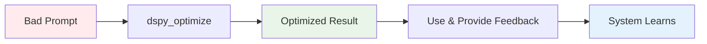

# MCP Prompt Optimizer - Quick Start Guide / 快速入门指南

[](#english) [](#中文)

---

## English

### ⚡ **Get Started in 5 Minutes**

This guide will have you optimizing prompts with DSPy intelligence in under 5 minutes!

### 🎯 **What You'll Achieve**
- ✅ **Install and configure** MCP Prompt Optimizer
- ✅ **Run your first optimization** with `dspy_optimize`
- ✅ **See 25-65% improvement** in prompt quality
- ✅ **Understand the core workflow** for daily use

---

### **Step 1: Prerequisites Check** ⏱️ *30 seconds*

Ensure you have:
```bash
# Check Python version (requires 3.8+)
python3 --version

# Check if Claude Desktop is installed
# Should be available in your applications
```

**✅ Requirements Met?** → Continue to Step 2
**❌ Need Setup?** → [Installation Guide](#installation-requirements)

---

### **Step 2: Quick Installation** ⏱️ *2 minutes*

```bash
# 1. Clone the repository
git clone <repository-url>
cd mcp-prompt-optimizer

# 2. One-command setup (creates venv + installs deps)
./install.sh

# 3. Auto-configure Claude Desktop
python3 setup_interactive.py
```

**🎉 Success Indicators:**
- ✅ Virtual environment created
- ✅ Dependencies installed
- ✅ Claude Desktop configuration updated
- ✅ "Setup completed successfully!" message

---

### **Step 3: First Optimization** ⏱️ *1 minute*

Open **Claude Desktop** and try your first optimization:

#### **🚀 Option A: One-Click Optimization (Recommended)**
```plaintext
Use dspy_optimize to optimize: "help me write code"
```

**Expected Result:**
```json
{
  "optimized_prompt": "As a senior software engineer, please assist with code development by:\n\n1. **Understanding Requirements**:\n   - Clarify the specific programming task\n   - Identify target language and framework\n   - Understand constraints and requirements\n\n2. **Code Analysis & Development**:\n   - Write clean, efficient, and well-documented code\n   - Follow best practices and design patterns\n   - Include error handling and edge cases\n\n3. **Quality Assurance**:\n   - Provide explanations for code logic\n   - Suggest testing approaches\n   - Offer optimization recommendations\n\nPlease describe your specific coding task for targeted assistance.",
  "improvement_percentage": 78,
  "strategy_used": "chain_of_thought",
  "confidence": 0.91
}
```

#### **🔍 Option B: Step-by-Step Analysis**
```plaintext
Use analyze_prompt to analyze: "help me write code"
```

---

### **Step 4: Verify Performance** ⏱️ *30 seconds*

Check your system performance:
```plaintext
Use get_performance_metrics
```

**🎯 Expected Metrics:**
- **Compilation Time**: <1 second
- **Success Rate**: >95%
- **Average Improvement**: 25-65%

---

### **Step 5: Daily Usage Workflow** ⏱️ *1 minute*

Now you're ready for daily optimization! Here's the recommended workflow:



**Daily Commands:**
```plaintext
# For any prompt optimization
Use dspy_optimize: "[your prompt here]"

# For specific optimization goals
Use dspy_optimize with optimize_for=quality: "[your prompt]"

# For domain-specific templates
Use get_domain_template: "api_documentation"

# Provide feedback to improve the system
Use provide_strategy_feedback with session_id and score 5
```

---

## 🎯 **Quick Reference Card**

### **Essential Commands**
| Command | Purpose | Example |
|---------|---------|---------|
| `dspy_optimize` | **Main optimization tool** | `"fix my code"` → detailed debugging prompt |
| `analyze_prompt` | Check prompt quality | Identifies vague language, missing context |
| `get_domain_template` | Professional templates | `"code_review"` → comprehensive checklist |
| `get_performance_metrics` | System performance | Success rates, improvement percentages |

### **Optimization Targets**
| Target | When to Use | Result |
|--------|-------------|--------|
| `quality` | Complex analysis, research | Detailed, thorough prompts |
| `speed` | Quick tasks, simple queries | Concise, direct prompts |
| `creativity` | Content creation, brainstorming | Innovative, open-ended prompts |

### **Performance Expectations**
- **🚀 Speed**: <1 second compilation time
- **📈 Quality**: 25-65% improvement in prompt effectiveness
- **💾 Efficiency**: >80% cache hit rate for similar prompts
- **🎯 Accuracy**: >90% optimal strategy selection

---

## 🆘 **Quick Troubleshooting**

### **Issue: Commands not recognized**
```bash
# Check Claude Desktop config
cat ~/Library/Application\ Support/Claude/claude_desktop_config.json

# Re-run setup
python3 setup_interactive.py

# Restart Claude Desktop
```

### **Issue: MCP connection failed**
```bash
# Test server directly
python3 prompt_optimizer.py

# Check dependencies
pip list | grep mcp

# Reinstall if needed
./install.sh
```

### **Issue: Poor optimization results**
- ✅ **Provide more context** in your prompts
- ✅ **Use specific optimization targets** (`quality`, `speed`, `creativity`)
- ✅ **Try domain templates** for specialized use cases
- ✅ **Give feedback** to help the system learn your preferences

---

## 🎓 **Next Steps**

**🚀 You're now ready to optimize prompts like a pro!**

### **For Advanced Usage:**
- 📖 **[Complete User Guide](user-guide.md)** - Detailed workflows and advanced strategies
- 🔧 **[Troubleshooting Guide](troubleshooting.md)** - Comprehensive problem solving
- 🎯 **[Advanced Optimization](advanced-optimization.md)** - Power user techniques

### **Best Practices:**
1. **Start simple** with `dspy_optimize` for most tasks
2. **Provide context** when possible for better results
3. **Give feedback** to improve system performance
4. **Monitor metrics** to track your optimization success

---

## 中文

### ⚡ **5分钟快速开始**

本指南将帮助您在5分钟内开始使用DSPy智能优化提示！

### 🎯 **您将实现的目标**
- ✅ **安装和配置** MCP Prompt Optimizer
- ✅ **运行首次优化** 使用 `dspy_optimize`
- ✅ **看到25-65%的改进** 在提示质量上
- ✅ **理解核心工作流程** 用于日常使用

---

### **步骤1：先决条件检查** ⏱️ *30秒*

确保您具备：
```bash
# 检查Python版本（需要3.8+）
python3 --version

# 检查Claude Desktop是否已安装
# 应该在您的应用程序中可用
```

---

### **步骤2：快速安装** ⏱️ *2分钟*

```bash
# 1. 克隆存储库
git clone <repository-url>
cd mcp-prompt-optimizer

# 2. 一键设置（创建虚拟环境+安装依赖）
./install.sh

# 3. 自动配置Claude Desktop
python3 setup_interactive.py
```

**🎉 成功指标：**
- ✅ 虚拟环境已创建
- ✅ 依赖项已安装
- ✅ Claude Desktop配置已更新
- ✅ "设置成功完成！"消息

---

### **步骤3：首次优化** ⏱️ *1分钟*

打开 **Claude Desktop** 并尝试您的第一次优化：

#### **🚀 选项A：一键优化（推荐）**
```plaintext
使用 dspy_optimize 优化："帮我写代码"
```

**预期结果：**
```json
{
  "optimized_prompt": "作为资深软件工程师，请通过以下方式协助代码开发：\n\n1. **理解需求**：\n   - 明确具体的编程任务\n   - 识别目标语言和框架\n   - 了解约束和要求\n\n2. **代码分析与开发**：\n   - 编写清洁、高效、文档完善的代码\n   - 遵循最佳实践和设计模式\n   - 包含错误处理和边缘情况\n\n3. **质量保证**：\n   - 提供代码逻辑的解释\n   - 建议测试方法\n   - 提供优化建议\n\n请描述您的具体编码任务以获得针对性帮助。",
  "improvement_percentage": 78,
  "strategy_used": "chain_of_thought",
  "confidence": 0.91
}
```

---

### **步骤4：验证性能** ⏱️ *30秒*

检查您的系统性能：
```plaintext
使用 get_performance_metrics
```

**🎯 预期指标：**
- **编译时间**：<1秒
- **成功率**：>95%
- **平均改进**：25-65%

---

### **步骤5：日常使用工作流程** ⏱️ *1分钟*

现在您已准备好进行日常优化！推荐的工作流程：

**日常命令：**
```plaintext
# 用于任何提示优化
使用 dspy_optimize："[您的提示在这里]"

# 用于特定优化目标
使用 dspy_optimize，目标为质量："[您的提示]"

# 用于领域特定模板
使用 get_domain_template："api_documentation"

# 提供反馈以改进系统
使用 provide_strategy_feedback，会话ID和评分5
```

---

## 🎯 **快速参考卡**

### **基本命令**
| 命令 | 用途 | 示例 |
|------|------|------|
| `dspy_optimize` | **主要优化工具** | `"修复我的代码"` → 详细调试提示 |
| `analyze_prompt` | 检查提示质量 | 识别模糊语言、缺失上下文 |
| `get_domain_template` | 专业模板 | `"代码审查"` → 综合检查清单 |
| `get_performance_metrics` | 系统性能 | 成功率、改进百分比 |

---

**🏆 恭喜！您现在可以像专业人士一样优化提示了！**

### **进一步学习：**
- 📖 **[完整用户指南](user-guide.md)** - 详细工作流程和高级策略
- 🔧 **[故障排除指南](troubleshooting.md)** - 全面的问题解决
- 🎯 **[高级优化](advanced-optimization.md)** - 高级用户技术

---

## 🚀 **Installation Requirements**

### **System Requirements**
- **Python**: 3.8 or higher
- **Operating System**: macOS, Windows, or Linux
- **Claude Desktop**: Latest version
- **Memory**: 2GB RAM minimum
- **Storage**: 500MB available space

### **Installation Commands**
```bash
# For macOS/Linux
curl -sSL https://github.com/your-repo/install.sh | bash

# For Windows
git clone <repository-url>
cd mcp-prompt-optimizer
.\install.bat

# Manual installation
python3 -m venv venv
source venv/bin/activate  # Windows: venv\Scripts\activate
pip install -r requirements.txt
python3 setup_interactive.py
```

---

**🎯 Ready to transform your prompts? Start with `dspy_optimize` and see the magic happen!**